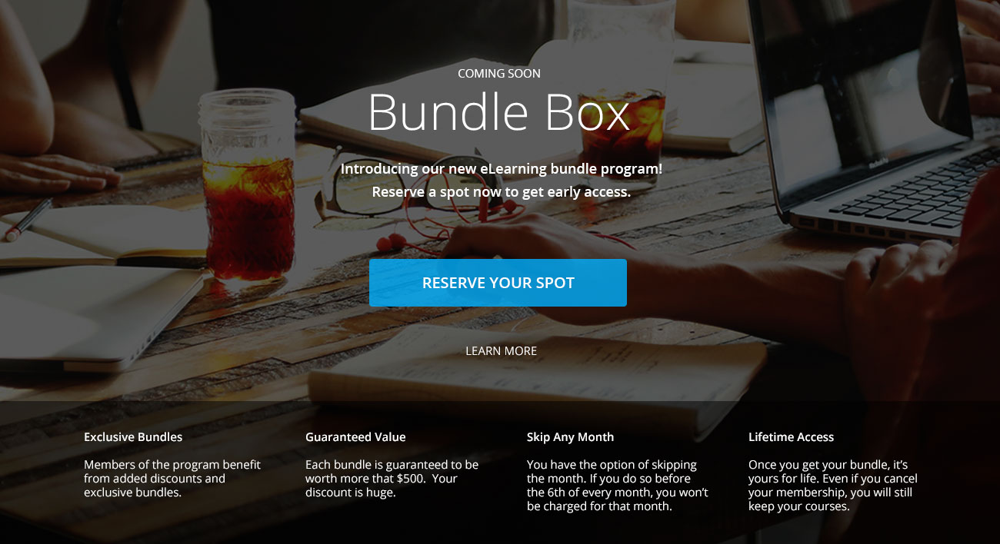
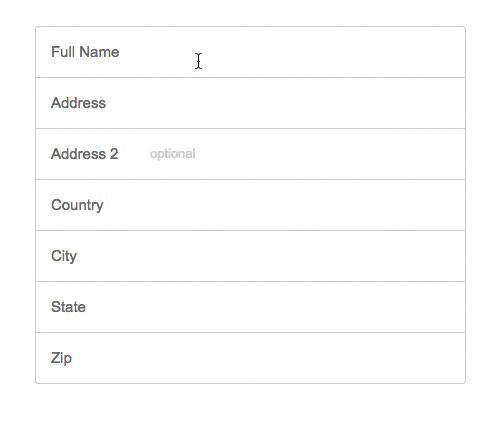

# StackCommerce HTML/CSS Challenge

## Goals

This challenge is to test your skills and ability in being able to build templates, elements and pages based off of a design mockup.
There are three parts to this challenge.

## Submission Guidelines

1. Zip all html/css/js files and email to [dev-challenge@stacksocial.com](mailto:dev-challenge@stacksocial.com)
  1. Please aim to use relative links for all asset linking.

## Requirements

### Part 1: Responsive Landing Page Layout

1. Build this landing page where the background image is always full screen.
1. Build it in such a way that it is responsive.
1. Use the mockup below as a guide.

 

**Background image asset to use**

### Part 2: Responsive Email Template

1. Build this email template in a way that is responsive **without using media queries** that supports most email clients including Outlook.
1. The layout should be a 2 column layout on desktop and a 1 column layout on mobile. 	
1. Use the mockups below as a guide.

 
 

### Part 3: Custom Form Fields

1. Build a basic shipping information form based off the mockup below. Make it as close to the mockup as you can.

### Part 3 (BONUS): Custom Form Field Focus State Interaction

1. When a user focus's into a field, the label area becomes gray as visualized in the mockup above. 
1. You may use JavaScript (including jQuery).

