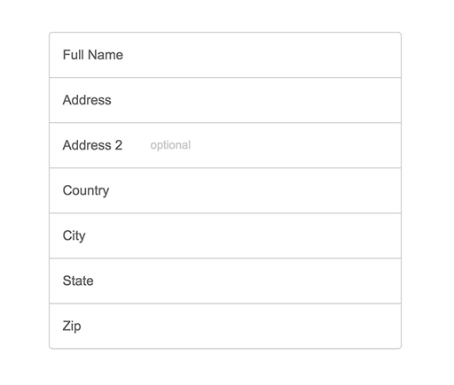

# StackSocial Frontend CSS Challenge

## Goals

This challenge is to test your skills and ability in being able to build elements based off of a design mockup.

##Submission Instructions

Email a link to a github repo with the code to devs@stacksocial.com

## Requirements

### Part 1: Custom Form Fields

1. Build a basic shipping information form based off the mockup above. Make it as close to the mockup as you can.

### Part 1 BONUS: Custom Form Field Focus State Interaction

1. When a user focus's into a field, the label area becomes gray as visualized in the mockup above. 
1. You can use js/jquery.

### Part 2: Responsive Landing Page Layout

 

1. Build this landing page where the background image is always full screen.
1. Build it in such a way that it is responsive.